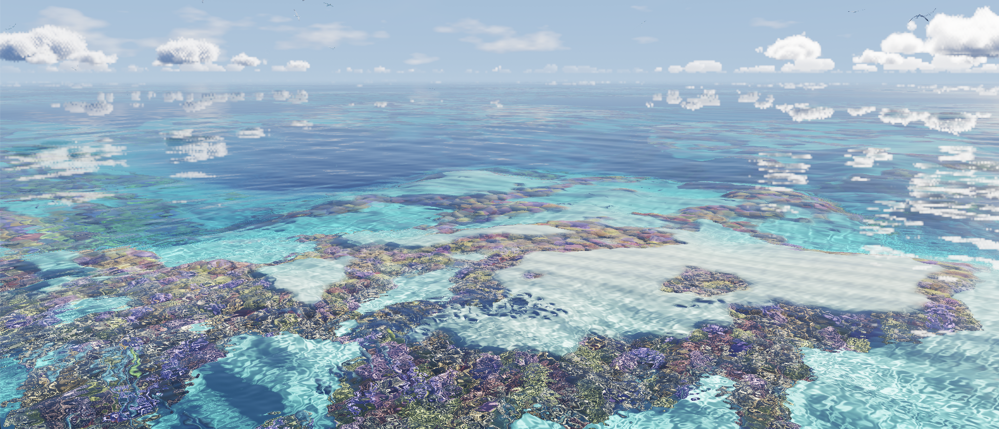

# Ocean WebGPU Painting Demo

A demo of painting a scene entirely on one triangle using fragment shaders.

- only one triangle
- parallax shading the ocean bed
- refraction shading
- GPGPU demo of Craig Reynolds' boids algorithm for aquatic animals, and flighted animals
- parallax shading for coral reef simulation
- ray-marched clouds
- skybox
- parallax shading feathers simulation
